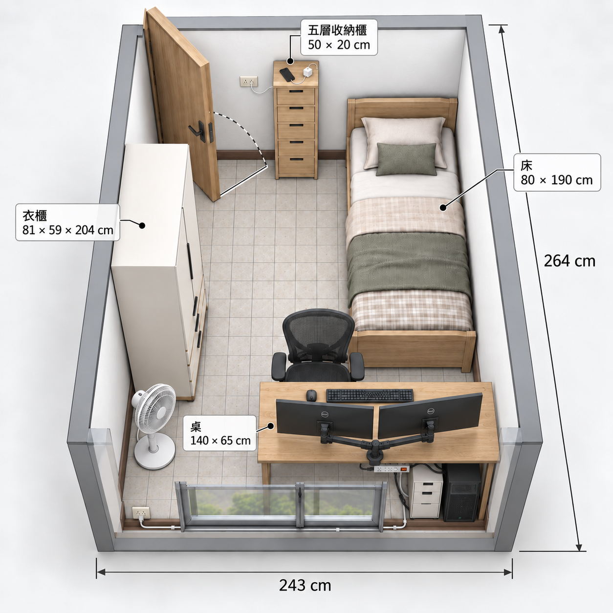

# Home Design

**English** · [繁體中文](README.zh-TW.md)



A browser-based room planner. Measure your room in centimetres, lay out furniture on a true-to-scale 2D plan, then walk through the result in a Three.js 3D preview — including first-person views as a 170 cm person standing, lying in bed, or sitting in the desk chair.

## Features

- **2D plan** drawn to scale in centimetres: drag furniture (5 cm snapping), rotate, resize, reorder layers, and get warnings for overlapping or out-of-room items.
- **Room settings**: interior width / depth / height, wall thickness, door (wall, position, width, height, swing angle, inward/outward, hinge side) and window position.
- **Wallpaper** in 8 colours and **floor** materials (light oak, walnut, herringbone, stone tile, self-levelling concrete, light-grey carpet).
- **3D preview** with shadows, image-based lighting, skirting boards, cornices, window sills and pleated linen curtains; automatic wall cut-away keeps the interior visible.
- **Camera modes** in 3D:
  - **Top-down orbit** — drag to rotate, wheel to zoom, middle/right-drag to pan.
  - **Walk-through (170 cm)** — eye height 158 cm; `W/A/S/D` or arrow keys to move, `←/→` to turn, hold `Shift` to go faster, drag to look around.
  - **Lying in bed** / **Sitting in the desk chair** — the view follows the selected bed or chair.
- **Window seascape**: blue sky, wind-driven volumetric clouds, a sandy beach and three-dimensional breaking waves, visible through windows from indoor first-person viewpoints only. Hidden entirely in orbit mode. The seascape-animation toggle pauses/plays both waves and clouds; reduced-motion preferences pause them automatically.
- **Collapsible side panels** and a frosted-glass view toolbar; help text lives in hover/focus tooltips.
- **Export**: copy the layout as JSON, or print the 2D plan.

## Getting started

There is **no build step and nothing to install** — the app is plain HTML, CSS and JavaScript. Libraries load from CDNs, so you need an internet connection.

The page must be served over **HTTP**. Opening `index.html` directly (`file://`) will show the 2D plan, but the 3D preview fails because browsers block ES-module imports from `file://`.

Pick any static file server and run it from the project folder:

```bash
# Python 3 (preinstalled on most systems)
python -m http.server 8765

# or Node.js
npx serve -l 8765
```

Then open <http://localhost:8765/>.

> **Tip:** after pulling new changes, hard-refresh with `Ctrl+Shift+R` (`Cmd+Shift+R` on macOS). Simple dev servers let the browser reuse cached CSS/JS.

**Requirements:** a current Chromium, Firefox or Safari with WebGL 2, ES modules and import maps. `backdrop-filter` is optional — the toolbar falls back to a solid background.

## Tech stack

| Area | Technology |
| --- | --- |
| Markup / logic | Vanilla HTML + JavaScript (no framework, no bundler) |
| Styling | [Tailwind CSS v4 browser build](https://tailwindcss.com/docs/installation/play-cdn) + `styles.css` for scrollbars, floor patterns, glass effects and print styles |
| UI behaviours | [Preline](https://preline.co/) (tabs, dropdown, mobile drawers, modal) |
| Icons / fonts | [Phosphor Icons](https://phosphoricons.com/), Geist / Geist Mono (Google Fonts) |
| 3D | [three.js](https://threejs.org/) 0.186 via an import map from jsDelivr (`OrbitControls`, `RoomEnvironment`, `BufferGeometryUtils`, `RoundedBoxGeometry`) |

## Project structure

```
index.html          Page layout, panels, toolbar, import map
styles.css          Styles Tailwind can't express cleanly
app.js              App state, 2D plan rendering, panels, inputs, tooltips
room-three.js       3D scene: room geometry, lighting, cameras, controls
furniture-three.js  Procedural 3D furniture models
ocean-three.js      Window ocean height field, beach and volumetric-cloud shader
smoke-test.html     In-browser regression check
home-design.png     Screenshot
```

## How the 2D plan is drawn

- All state is stored in **centimetres** (`state.room`, `state.door`, `state.window`, `state.items`).
- `computeScale()` fits the room into the viewport and multiplies by the zoom level to get **pixels per centimetre**.
- `render2DRoom()` builds the plan from absolutely positioned DOM elements: a wall box coloured by the wallpaper, a floor with a CSS pattern class, door/window openings, furniture and dimension labels.
- Each furniture type is an **inline SVG whose `viewBox` equals its real footprint in cm**, so proportions stay true to scale at any size.
- The door's swing arc and angle are computed by `doorPlan()` and drawn as SVG.
- Overlap and out-of-room checks compare axis-aligned footprints (`itemsOverlap`, `itemOutsideRoom`), taking 90° rotations into account.

## How the 3D preview is rendered

- `room-three.js` is **lazy-loaded** with `import()` the first time you switch to 3D, so the 2D editor never waits on three.js.
- **1 scene unit = 1 cm**, matching the 2D state, so both views read the same data.
- **Walls** are subdivided around every door and window opening (`rectangles()`), so overlapping openings still cut correctly. Floors and doors use small textures drawn on a `<canvas>` at runtime.
- **Lighting**: a PMREM-filtered `RoomEnvironment` for soft image-based light, plus a hemisphere light and one shadow-casting directional light (PCF soft shadows).
- **Refined materials** extend the PBR shaders with plaster relief, wood grain, stone mottling and textile weave, using centimetre-scale detail and derivative filtering to limit distant shimmer. Wood floors have a thin clearcoat; furniture uses bump maps, fabric sheen, metallic reflections and rounded cushions. Material detail needs no extra texture downloads or continuous animation.
- **Window dressing and trim** follow room/opening edits, leave door openings clear and hide with their wall. These are 3D decorative details, not additional 2D footprints or exported layout data.
- **Seascape** (`ocean-three.js`) traces a three-dimensional coast along the actual eye/window ray on window-opening planes behind the glass, giving perspective and parallax when moving. Frames, curtains and furniture occlude it normally, and overlapping door openings stay clear. It appears only when a first-person camera's eye is inside the room, never as the whole scene's background; orbit mode always hides it.
- **Physics-inspired rendering** uses an approximate height field with gravity-wave dispersion, compressed shallow-water wavelengths, depth-limited crests and swash, plus wave normals, Fresnel reflections, wet sand and retreating foam. Volumetric clouds advect with wind and integrate absorption, scattering and approximate self-shadowing. This is a real-time visual model, not a full fluid solver; distant seas use a flat surface and atmospheric extinction instead of tracing sub-pixel waves.
- **Furniture** (`furniture-three.js`) is built from boxes, cylinders, tori and extruded shapes. Each type is built once, merged into **one mesh per material** with `mergeGeometries`, then cloned and scaled to each item's real width/depth/height. Every copy of a type shares its geometry, so each needs only one draw call per material.
- **Rendering is on demand** for camera/state/size edits, with continuous frames only while the animated seascape is in an indoor first-person camera's frustum. Pausing, switching to orbit/2D or hiding the page stops waves and clouds; shadow maps update only when geometry or occlusion changes.
- **Cut-away**: in the top-down view, walls facing the camera are hidden automatically.
- **First-person modes** swap `OrbitControls` into a look-around setup (target 1 cm in front of the eye). A ceiling is shown and all walls are visible. Walking reads held keys every frame, so movement and turning are continuous and frame-rate independent. Walls block the walker; furniture does not.
- Clicking furniture in 3D selects it via raycasting. WebGL context loss/restore is handled, and the 2D editor keeps working.

## Testing

With the server running, open <http://localhost:8765/smoke-test.html>. It loads the app in an iframe and checks furniture bounds, 2D/3D syncing, all six floor finishes, the indoor seascape, breaking waves, wind-driven clouds, animation pause, and restoration of the orbit view.
