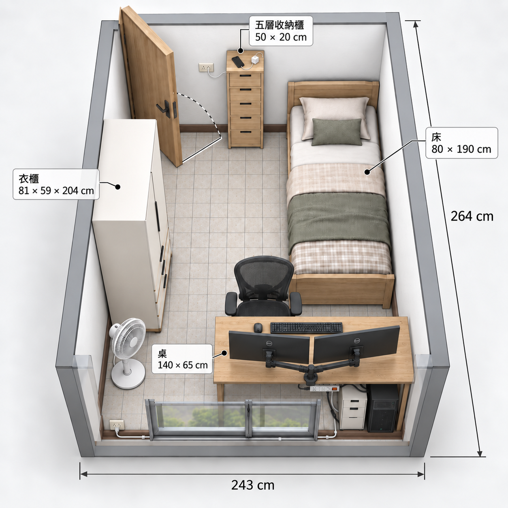

# 格局規劃工具

[English](README.md) · **繁體中文**



在瀏覽器中使用的房間格局規劃工具。以公分輸入房間實測尺寸，在等比例的 2D 平面圖上擺放家具，再切換到 Three.js 3D 預覽檢視成果。3D 還能以 170 cm 身高的人物視角站著巡視、躺在床上，或坐在電腦椅上。

## 功能

- **2D 平面圖**以公分等比繪製：拖曳家具（吸附 5 cm）、旋轉、調整尺寸、調整圖層順序，家具重疊或超出房間會有提示。
- **房間設定**：室內寬、深、高、牆厚；門（所在牆面、位置、寬高、開門角度、內開／外開、鉸鏈端）與窗戶位置。
- **壁紙** 8 種顏色與**地板**材質（淺橡木、胡桃木、人字拼、灰石磚、水泥自流平、淺灰地毯）。
- **3D 預覽**：陰影、環境光照，並自動隱藏擋住視線的牆面。
- **3D 視角模式**：
  - **俯視**：拖曳旋轉、滾輪縮放、按住中鍵或右鍵拖曳平移。
  - **站立巡視（170 cm）**：視線高 158 cm；`W/A/S/D` 或方向鍵移動、`←/→` 轉頭、按住 `Shift` 加速，拖曳環顧四周。
  - **躺在床上**／**坐在電腦椅**：位置跟著選取的床或椅子。
- 兩側面板可**收合**，檢視工具列為**毛玻璃**效果；說明文字改用滑鼠移上或鍵盤聚焦時出現的提示框（tooltip）。
- **匯出**：複製版面設定 JSON，或列印 2D 平面圖。

## 啟用方式

**不需要建置，也不需要安裝任何套件**。整個專案是純 HTML、CSS、JavaScript，函式庫都從 CDN 載入，所以需要網路連線。

網頁必須透過 **HTTP** 開啟。直接雙擊 `index.html`（`file://`）雖然看得到 2D 平面圖，但 3D 預覽會失敗，因為瀏覽器禁止從 `file://` 載入 ES 模組。

在專案資料夾執行任一種靜態伺服器：

```bash
# Python 3（多數系統已內建）
python -m http.server 8765

# 或 Node.js
npx serve -l 8765
```

再用瀏覽器開啟 <http://localhost:8765/>。

> **提示：** 更新程式碼後，請按 `Ctrl+Shift+R`（macOS 為 `Cmd+Shift+R`）強制重新整理。簡易伺服器常讓瀏覽器沿用舊的 CSS／JS 快取。

**瀏覽器需求：** 支援 WebGL 2、ES 模組與 import map 的新版 Chromium、Firefox 或 Safari。`backdrop-filter`（毛玻璃）不支援時，工具列會改用實色背景。

## 使用技術

| 項目 | 技術 |
| --- | --- |
| 結構與邏輯 | 原生 HTML + JavaScript（無框架、無打包工具） |
| 樣式 | [Tailwind CSS v4 瀏覽器版](https://tailwindcss.com/docs/installation/play-cdn)，加上 `styles.css` 處理捲軸、地板圖樣、毛玻璃與列印樣式 |
| UI 互動 | [Preline](https://preline.co/)（分頁、下拉選單、手機版抽屜、對話框） |
| 圖示與字型 | [Phosphor Icons](https://phosphoricons.com/)、Geist／Geist Mono（Google Fonts） |
| 3D | [three.js](https://threejs.org/) 0.186，透過 import map 從 jsDelivr 載入（`OrbitControls`、`RoomEnvironment`、`BufferGeometryUtils`） |

## 檔案結構

```
index.html          頁面版型、面板、工具列、import map
styles.css          Tailwind 不易表達的樣式
app.js              狀態管理、2D 平面繪製、面板、輸入欄位、提示框
room-three.js       3D 場景：房間幾何、光照、攝影機、操作控制
furniture-three.js  以程式產生的 3D 家具模型
smoke-test.html     瀏覽器內的回歸檢查
home-design.png     截圖
```

## 2D 平面如何繪製

- 所有狀態都以**公分**儲存（`state.room`、`state.door`、`state.window`、`state.items`）。
- `computeScale()` 依可視區域算出能放下整個房間的比例，再乘上縮放倍率，得到**每公分對應的像素數**。
- `render2DRoom()` 用絕對定位的 DOM 元素組出平面圖：套用壁紙顏色的牆體、帶 CSS 圖樣的地板、門窗開口、家具與尺寸標籤。
- 每種家具都是**行內 SVG，`viewBox` 等於實際佔地公分數**，任何縮放下比例都正確。
- 門的開啟弧線與角度由 `doorPlan()` 計算，再以 SVG 繪製。
- 重疊與超出房間的判斷，是比對考慮 90° 旋轉後的矩形佔地（`itemsOverlap`、`itemOutsideRoom`）。

## 3D 物件如何渲染

- `room-three.js` 在第一次切換到 3D 時才用 `import()` **延遲載入**，2D 編輯不需等待 three.js。
- **1 個場景單位 = 1 公分**，與 2D 共用同一份資料。
- **牆面**會依每個門窗開口切割（`rectangles()`），門窗範圍重疊也能正確挖洞。地板與門的材質是執行時在 `<canvas>` 上繪製的小貼圖。
- **光照**：以 PMREM 處理的 `RoomEnvironment` 提供柔和的環境光，再加上半球光，以及一盞會產生陰影的平行光（PCF 柔和陰影）。
- **家具**（`furniture-three.js`）由方塊、圓柱、圓環與擠出形狀組成。每種家具只建一次，用 `mergeGeometries` **依材質合併成單一網格**，再依各家具的實際寬、深、高複製並縮放。同類家具共用幾何資料，每種材質只需一次繪製呼叫。
- **按需渲染**：只有攝影機、資料或尺寸改變時才重繪畫面；陰影貼圖也只在物件移動時更新。
- **自動隱藏牆面**：俯視時，朝向鏡頭的牆會自動隱藏。
- **第一人稱模式**把 `OrbitControls` 改成環顧模式（注視點在眼前 1 cm），並顯示天花板與四面牆。行走時每一幀讀取按住的按鍵，移動與轉向連續、不受幀率影響。牆壁會擋住行走，家具不會。
- 在 3D 中點選家具是透過光線投射（raycasting）判斷。WebGL 連線中斷或恢復時會妥善處理，2D 編輯仍可繼續使用。

## 測試

伺服器啟動後，開啟 <http://localhost:8765/smoke-test.html>。它會在 iframe 中載入本工具，檢查家具邊界以及 2D／3D 視圖同步。
